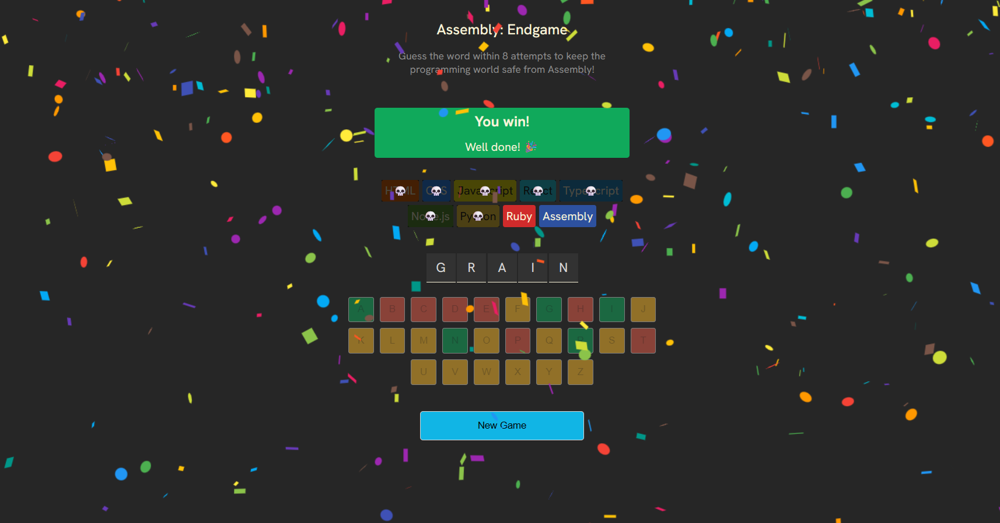

# Assembly Endgame

## Description
Assembly Endgame is a word-guessing game inspired by Hangman, built with React and Vite. The objective is to guess the randomly selected word within 8 attempts. Each incorrect guess results in the elimination of a popular programming language from the screen. Guess the word correctly before all languages are eliminated to win and save the programming world from Assembly.

## Features
* Interactive word guessing mechanics.
* Visual elimination of programming languages as incorrect guesses are made.
* On-screen keyboard with state-based visual feedback (correct, incorrect, or unselected).
* Confetti animation upon a successful game completion.
* Dynamic status messages and farewell quotes for eliminated languages.
* Accessible UI, including screen reader support and aria-live regions.

## Technologies Used
* React 19
* Vite
* JavaScript (ES6+)
* Custom CSS
* clsx (for conditional class name management)
* react-confetti

## Getting Started

### Prerequisites
Make sure you have Node.js and npm installed on your machine.

### Installation

1. Clone this repository or extract the project files.
2. Navigate to the project directory in your terminal.
3. Install the dependencies by running:
   ```bash
   npm install
   ```

### Running the Game

To start the development server, run:
```bash
npm run dev
```
Open the provided local URL in your web browser to play the game.

### Building for Production

To create a production-ready build, run:
```bash
npm run build
```
The compiled files will be generated in the `dist` directory.

## Project Structure
* `src/App.jsx`: Main application component containing the game logic, state management, and UI.
* `src/languages.js`: Configuration array defining the programming language chips and their styles.
* `src/words.js`: Dictionary of words from which the game randomly selects.
* `utils.js`: Helper functions for retrieving random words and farewell texts.
* `src/index.css` & `src/App.css`: Application styling.
